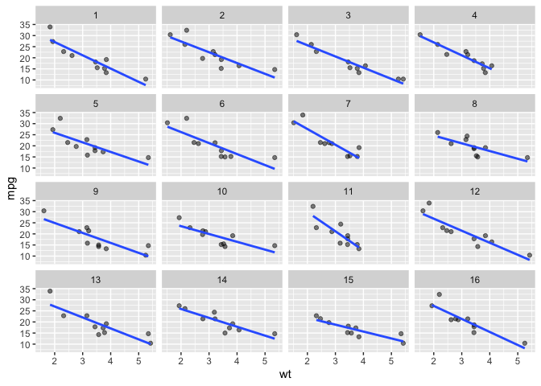

<!-- README.md is generated from README.Rmd. Please edit that file -->

# ggsample

<!-- badges: start -->
<!-- badges: end -->

The goal of ggsample provide easy-to-use functions for sampling. Package
is educational.

## Installation

<!-- You can install the released version of ggsample from [CRAN](https://CRAN.R-project.org) with: -->
<!-- ``` r -->
<!-- install.packages("ggsample") -->
<!-- ``` -->

And the development version from [GitHub](https://github.com/) with:

``` r
# install.packages("devtools")
devtools::install_github("EvaMaeRey/ggsample")
```

## Example

``` r
library(ggsample)
my_seed <- sample(1:100, 1)
library(ggplot2)
#> Warning: package 'ggplot2' was built under R version 3.6.2
ggplot(data = cars) +
  aes(x = speed, y = dist) +
  geom_point() +
  geom_smooth(method = lm,
             se = FALSE) +
   geom_point_sample(color = "red",
                     seed = my_seed) +
   geom_lm_sample(color = "red",
                  seed = my_seed)
#> Default sample_size is 10
#> sample size is 10 by default
#> `geom_smooth()` using formula 'y ~ x'
```


