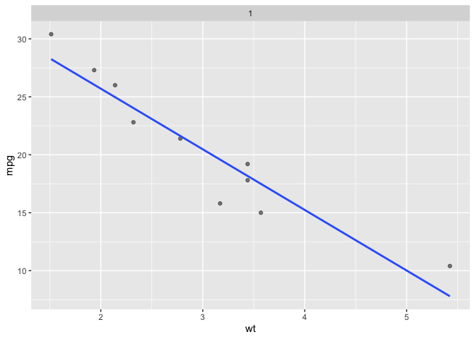

<!-- README.md is generated from README.Rmd. Please edit that file -->

# ggsample

<!-- badges: start -->

<!-- badges: end -->

The goal of ggsample provide functions for sampling. The facet\_\*
functions could be especially statistical education in helping visualize
hypothetical scenarios (like sampling from known population) or
demonstrating resampling techniques. The facet\_\* functions mostly
borrow from the ggplot2 extension vignette [(extending existing facet
function)](https://github.com/tidyverse/ggplot2/blob/5f518d02af27160ab98fed736a472321d72d10d2/vignettes/extending-ggplot2.Rmd#L1028).
But a seed setting move has been added such that the layers in each
facet are looking at the same sampling frame; i.e. geom\_smooth() will
be acting on the same data as geom\_point() points This which didn’t
seem to be the case when only using the vignette strategy as-is. The
functions are:

  - `facet_sample()`
  - `facet_sample_prop()`
  - `facet_bootstrap()`
  - `facet_scramble()`

There are also some geom experiments, which I think might be less
useful.

## Installation

<!-- You can install the released version of ggsample from [CRAN](https://CRAN.R-project.org) with: -->

<!-- ``` r -->

<!-- install.packages("ggsample") -->

<!-- ``` -->

And the development version from [GitHub](https://github.com/) with:

``` r
# install.packages("devtools")
devtools::install_github("EvaMaeRey/ggsample")
```

## Examples

Below we display 9 panels with different a sample of 16 (n\_facets
default) observations taken.

``` r
library(ggplot2)
library(ggsample)

# facet_sample
ggplot(data = mtcars) +
   aes(x = wt) +
   aes(y = mpg) +
   facet_sample(n_sampled = 10) +
   geom_point(alpha = .5) +
   geom_smooth(method = lm, se = F)
#> `geom_smooth()` using formula = 'y ~ x'
```


We can also sample by specifying a proportion with
facet\_sample\_prop().

``` r
# facet_sample_prop
ggplot(data = mtcars) +
   aes(x = wt) +
   aes(y = mpg) +
   facet_sample_prop(prop = .2, 
                n_facets = 9) +
   geom_point(alpha = .5) +
   geom_smooth(method = lm, se = F)
#> `geom_smooth()` using formula = 'y ~ x'
```


We can also bootstrap taking a sample of nrow(data) with replacement via
facet\_bootstrap().

``` r
# facet_bootstrap
ggplot(data = mtcars) +
   aes(x = wt) +
   aes(y = mpg) +
   facet_bootstrap() +
   geom_count(alpha = .2) +
   geom_smooth(method = lm, se = F) 
#> `geom_smooth()` using formula = 'y ~ x'
```


Looking at disassociated data (variables in a dataset are randomly
reordered) is also possible via facet\_scramble().

``` r
# facet_scramble
ggplot(data = mtcars) +
   aes(x = wt) +
   aes(y = mpg) +
   facet_scramble(n_facets = 9) +
   geom_point(alpha = .2) +
   geom_smooth(method = lm, se = F) 
#> `geom_smooth()` using formula = 'y ~ x'
```


# Simulating reality: single sample realization with `facet_*(n_facets = 1)`

You can use `facet_*(n_facets = 1)` to see a single realization. In a
classroom setting you can re-execute code to see multiple realizations
one at a time. last\_plot() does *not* produce a fresh sample; but
overriding facet\_sample does work.

I wonder if some helpers might be nice like facet\_sample\_once() for
this special case.

``` r
ggplot(data = mtcars) +
   aes(x = wt) +
   aes(y = mpg) +
   facet_sample(n_sampled = 10,
                n_facets = 1) +
   geom_point(alpha = .5) +
   geom_smooth(method = lm, se = F)
#> `geom_smooth()` using formula = 'y ~ x'
```


``` r

# replace facet declaration
last_plot() + facet_sample(n_sampled = 10, n_facets = 1)
#> `geom_smooth()` using formula = 'y ~ x'
```



# Functions internals…

Here, you’ll see a lot of cloned code from the ggplot2 extension
vignette\!
<https://github.com/tidyverse/ggplot2/blob/5f518d02af27160ab98fed736a472321d72d10d2/vignettes/extending-ggplot2.Rmd#L1028>
The small contribution made here is the seed parameter which, ensures
that layers are displayed based on the same sample (geom\_smooth
reflects the same data as geom\_point) which seems to have worked.

There is a lot of repetition in what’s below and it might be good to try
to consolidate some of this at some point.

``` r
compute_layout_sample <- function(data, params) {
  
      id     <- seq_len(params$n)
      dims   <- wrap_dims(params$n, params$nrow, params$ncol)
      layout <- data.frame(PANEL = factor(id))

      if (params$as.table) { layout$ROW <- as.integer((id - 1L) %/% dims[2] + 1L)
      } else {               layout$ROW <- as.integer(dims[1] - (id - 1L) %/% dims[2]) }
      
                             layout$COL <- as.integer((id - 1L) %% dims[2] + 1L)

      layout <- layout[order(layout$PANEL), , drop = FALSE]
                                  
      rownames(layout) <- NULL

      # Add scale identification
      layout$SCALE_X <- if (params$free$x) id else 1L
      layout$SCALE_Y <- if (params$free$y) id else 1L

      cbind(layout, .bootstrap = id)
      
      }
```

``` r


map_data_sample <- function(data, layout, params) {
  
      if (is.null(data) || nrow(data) == 0) {return(cbind(data, PANEL = integer(0)))}
                                  
      set.seed(params$seed) # adding this
                                  
      n_sampled <- params$n_sampled
      
      new_data <- lapply(seq_len(params$n), function(i) {
        cbind(data[sample(nrow(data), n_sampled), , drop = FALSE], PANEL = i)
                                  })
      do.call(rbind, new_data)
                                
      }

FacetSample <- ggplot2::ggproto(
  `_class`   = "FacetSample", 
  `_inherit` = ggplot2::FacetWrap,
  compute_layout = compute_layout_sample,
  map_data = map_data_sample
)

#' Title
#'
#' @param n_facets number of facets
#' @param nrow how many rows for facet grid
#' @param ncol how many columns for facet grid
#' @param scales should x and y scales be determined independently for facets
#' @param shrink not sure what shrink does
#' @param strip.position where facet label should go
#' @param n_sampled sample size
#' @param seed randomization start point
#'
#' @return a ggplot2 facet specification
#' @export
#'
#' @examples
#' # mean from samples
#' library(ggplot2)
#' ggplot(data = mtcars) +
#'    aes(x = wt) +
#'    aes(y = mpg) +
#'    facet_sample(n_sampled = 10, 
#'                 n_facets = 9,
#'                 nrow = 3) +
#'    geom_point(alpha = .5) +
#'    geom_smooth(method = lm, se = F)
#'   labs(subtitle = "Depending on our particular random sample...") 
facet_sample <- function(n_facets = 16, n_sampled = 5, nrow = NULL, ncol = NULL,
                         scales = "fixed", shrink = TRUE, strip.position = "top",
                         seed = sample(2000:3000, 1)) {

  facet <- ggplot2::facet_wrap(~.bootstrap, nrow = nrow, ncol = ncol, scales = scales,
                               shrink = shrink, strip.position = strip.position)
  
  facet$params$n <- n_facets
  facet$params$n_sampled <- n_sampled
  facet$params$seed <- seed

  ggplot2::ggproto(`_class` = NULL, 
                   `_inherit` = FacetSample,
                   shrink = shrink,
                   params = facet$params)
  
}
```

### try it out

``` r
library(ggplot2)
ggplot(data = mtcars) +
   aes(x = wt) +
   aes(y = mpg) +
   facet_sample(n_sampled = 10, 
                n_facets = 9,
                nrow = 3) +
   geom_point(alpha = .5) +
   geom_smooth(method = lm, se = F)
#> `geom_smooth()` using formula = 'y ~ x'
```


### facet\_sample\_prop()

``` r
#' Title
#'
#' @inheritParams facet_sample
#' @param prop numeric proportion to sample, defaults to .2
#'
#' @return
#' @export
#'
#' @examples
#' set.seed(1323)
#' library(ggplot2)
#' ggplot(data = cars) +
#'   aes(x = speed) +
#'   aes(y = dist) +
#'   geom_point(color = "olivedrab4") +
#'   geom_smooth(method = lm, se = FALSE) +
#'   facet_sample_prop() +
#'   labs(title = "Random Sample, 20% of population")
facet_sample_prop <- function(n_facets = 9, prop = 0.2, nrow = NULL, ncol = NULL,
                            scales = "fixed", shrink = TRUE, strip.position = "top",
                         seed = sample(2000:3000, 1)) {

  facet <- ggplot2::facet_wrap(~.bootstrap, nrow = nrow, ncol = ncol, scales = scales,
                      shrink = shrink, strip.position = strip.position)
  
  facet$params$n <- n_facets
  facet$params$prop <- prop
  facet$params$seed <- seed

  ggplot2::ggproto(NULL, FacetSampleProp,
          shrink = shrink,
          params = facet$params
  )
}


map_data_sample_prop <- function(data, layout, params) {
                            if (is.null(data) || nrow(data) == 0) {
                              return(cbind(data, PANEL = integer(0)))
                            }
                            set.seed(params$seed)
                            n_samples <- round(nrow(data) * params$prop)
                            new_data <- lapply(seq_len(params$n), function(i) {
                              cbind(data[sample(nrow(data), n_samples), , drop = FALSE], PANEL = i)
                            })
                            do.call(rbind, new_data)
                          }

FacetSampleProp <- ggplot2::ggproto("FacetSampleProp", ggplot2::FacetWrap,
                          compute_layout = compute_layout_sample,
                          map_data = map_data_sample_prop
)
```

### Try it out…

``` r
# facet_sample_prop
ggplot(data = mtcars) +
   aes(x = wt) +
   aes(y = mpg) +
   facet_sample_prop(prop = .1, 
                n_facets = 9,
                nrow = 3) +
   geom_point(alpha = .5) +
   geom_smooth(method = lm, se = F)
#> `geom_smooth()` using formula = 'y ~ x'
```


### facet\_bootstrap()

``` r
#' Resample with replacement
#'
#' @inheritParams facet_sample_prop
#'
#' @return
#' @export
#'
#' @examples
#' library(ggplot2)
#' set.seed(1323)
#' ggplot(data = cars) +
#'   aes(x = speed) +
#'   aes(y = dist) +
#'   geom_count(alpha = .5) +
#'   facet_bootstrap(n_facets = 1) +
#'   facet_bootstrap(n_facets = 2) +
#'   facet_bootstrap(n_facets = 3) +
#'   ggxmean::geom_lm() +
#'   ggxmean::geom_lm_formula() +
#'   facet_bootstrap(n_facets = 15)
facet_bootstrap <- function(n_facets = 9, prop = 1, nrow = NULL, ncol = NULL,
                            scales = "fixed", shrink = TRUE, strip.position = "top",
                            seed = sample(2000:3000, 1)) {

  facet <- ggplot2::facet_wrap(~.bootstrap, nrow = nrow, ncol = ncol, scales = scales,
                      shrink = shrink, strip.position = strip.position)
  facet$params$n <- n_facets
  facet$params$prop <- prop
  facet$params$seed <- seed
  ggplot2::ggproto(NULL, FacetBootstrap,
          shrink = shrink,
          params = facet$params
  )
}

map_data_bootstrap <- function(data, layout, params) {
                            if (is.null(data) || nrow(data) == 0) {
                              return(cbind(data, PANEL = integer(0)))
                            }
                            n_samples <- round(nrow(data) * params$prop)
                            set.seed(params$seed)
                            new_data <- lapply(seq_len(params$n), function(i) {
                              cbind(data[sample(nrow(data), n_samples, replace = T), , drop = FALSE], PANEL = i)
                            })
                            do.call(rbind, new_data)
                          }

FacetBootstrap <- ggplot2::ggproto("FacetBootstrap", ggplot2::FacetWrap,
                          compute_layout = compute_layout_sample,
                          map_data = map_data_bootstrap
)
```

### Test it out…

``` r

# facet_bootstrap
ggplot(data = mtcars) +
   aes(x = wt) +
   aes(y = mpg) +
   facet_bootstrap(n_facets = 9,
                   nrow = 3) +
   geom_count(alpha = .2) +
   geom_smooth(method = lm, se = F) 
#> `geom_smooth()` using formula = 'y ~ x'
```


### facet\_scramble

``` r
#' Title
#'
#' @inheritParams facet_sample_prop
#'
#' @return
#' @export
#'
#' @examples
#' library(ggplot2)
#' set.seed(232)
#' ggplot(data = cars) +
#'   aes(x = speed) +
#'   aes(y = dist) +
#'   geom_rug() +
#'   geom_point(color = "springgreen4",
#'            alpha = .75) +
#'   ggxmean:::geom_corrlabel() +
#'   labs(subtitle = "Pearson Correlation Coefficient(s)") +
#'   facet_scramble(n_facets = 1) +
#'   labs(title = "Disassociating variables") +
#'   facet_scramble(n_facets = 2) +
#'   facet_scramble(n_facets = 3) +
#'   facet_scramble(n_facets = 12) +
#'   ggxmean::geom_lm()
#'
facet_scramble <- function(n_facets = 9, prop = 1, nrow = NULL, ncol = NULL,
                            scales = "fixed", shrink = TRUE, strip.position = "top",
                           seed = sample(2000:3000, 1)) {

  facet <- ggplot2::facet_wrap(~.bootstrap, nrow = nrow, ncol = ncol, scales = scales,
                      shrink = shrink, strip.position = strip.position)
  facet$params$n <- n_facets
  facet$params$seed <- seed
  facet$params$prop <- prop
  ggplot2::ggproto(NULL, FacetScramble,
          shrink = shrink,
          params = facet$params
  )
}


shuffle <- function(dat){

  for(i in 1:ncol(dat)){
    dat[,i] = sample(dat[,i])
  }

  dat

}

map_data_shuffle <- function(data, layout, params) {
                            if (is.null(data) || nrow(data) == 0) {
                              return(cbind(data, PANEL = integer(0)))
                            }
                            set.seed(params$seed)
                            # n_samples <- round(nrow(data) * params$prop)
                            new_data <- lapply(seq_len(params$n), function(i) {
                              # data$y <- sample(data$y)

                              cbind(shuffle(data), PANEL = i)
                            })
                            do.call(rbind, new_data)
                          }

FacetScramble <- ggplot2::ggproto("FacetScramble", ggplot2::FacetWrap,
                          compute_layout = compute_layout_sample,
                          map_data = map_data_shuffle
)
```

### try it

``` r
# facet_scramble
ggplot(data = mtcars) +
   aes(x = wt) +
   aes(y = mpg) +
   facet_scramble(n_facets = 9,
                  nrow = 3) +
   geom_point(alpha = .2) +
   geom_smooth(method = lm, se = F) 
#> `geom_smooth()` using formula = 'y ~ x'
```


## Send to R dir

``` r
library(tidyverse)
#> ── Attaching core tidyverse packages ──────────────────────── tidyverse 2.0.0 ──
#> ✔ dplyr     1.1.4     ✔ readr     2.1.5
#> ✔ forcats   1.0.0     ✔ stringr   1.5.1
#> ✔ lubridate 1.9.3     ✔ tibble    3.2.1
#> ✔ purrr     1.0.2     ✔ tidyr     1.3.1
#> ── Conflicts ────────────────────────────────────────── tidyverse_conflicts() ──
#> ✖ dplyr::filter() masks stats::filter()
#> ✖ dplyr::lag()    masks stats::lag()
#> ℹ Use the conflicted package (<http://conflicted.r-lib.org/>) to force all conflicts to become errors
knitrExtra:::chunk_to_r("a_compute_layout_sample")
#> It seems you are currently knitting a Rmd/Qmd file. The parsing of the file will be done in a new R session.
knitrExtra:::chunk_to_r("facet_sample")
#> It seems you are currently knitting a Rmd/Qmd file. The parsing of the file will be done in a new R session.
knitrExtra:::chunk_to_r("facet_sample_prop")
#> It seems you are currently knitting a Rmd/Qmd file. The parsing of the file will be done in a new R session.
knitrExtra:::chunk_to_r("facet_bootstrap")
#> It seems you are currently knitting a Rmd/Qmd file. The parsing of the file will be done in a new R session.
knitrExtra:::chunk_to_r("facet_scramble")
#> It seems you are currently knitting a Rmd/Qmd file. The parsing of the file will be done in a new R session.
```
